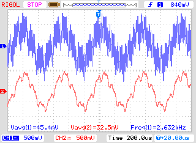

# FIR32 Petalinux Repository.
In this project a 32ord FIR filter coefficient are computed by C application from PetaLinux. FIR filter is implemented on RTL in Verilog. Input and output filter signals are synthesized by ZMOD DAC.

## Board file
Board file for EclypseZ7 can be found at Digilent's repository. (https://github.com/Digilent/vivado-boards/tree/master/new/board_files/eclypse-z7).

## Automatic project creation.
Project has a script associated to him. For create the project, init Vivado in tcl mode, and the execute the selected script.

```
cd <project folder>/script/
vivado -mode tcl -source ./fir32_plnx.tcl
```
## Hardware configuration
Project in this repository are designed to run in Eclypse Z7 board from Digilent, with ZMOD DAC in ZMOD socket A and ZMOD ADC in ZMOD socket B.  
https://store.digilentinc.com/eclypse-z7-zynq-7000-soc-development-board-with-syzygy-compatible-expansion/

## Python Script
This repository include a jupyter notebook for generate .mem files. Files generated by script are saved in */memory_content* directory.

**fir32_plnx.tcl**  
This project uses the PS for run Petalinux, and the PL for implement a 32th order FIR filter. This filter will filter the signal stored in bram. Filter will be configured from petaliux application available in app folder. Input and outputs signals are sent to Digilent's ZMOD DAC.  
Application has 3 input params: Cut frequency (0-500 -> 0-0.5), Gain (0-200 -> 0-2), and apply a hamming window or not (0,1). For more detailed explanation, visit https://www.controlpaths.com Block design scripts are included only for Vivado 2019.1 and 2020.1. If you use other version, in /doc folder, you can find a picture of block design.  
  

## More information
If you need more information, yo can contact me on my email pablo@controlpaths.com
