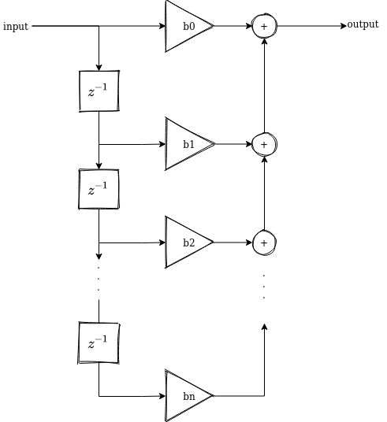
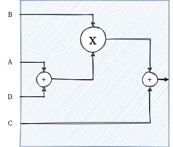
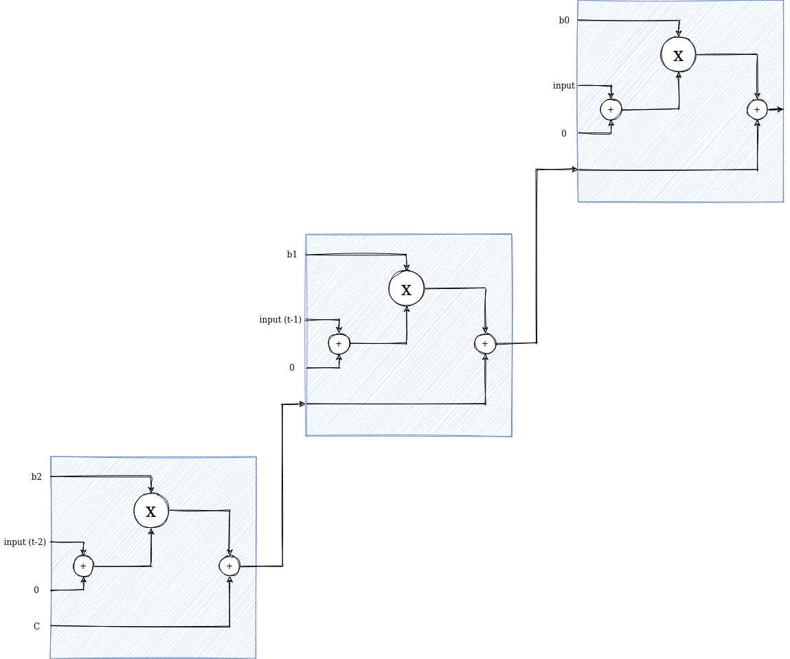
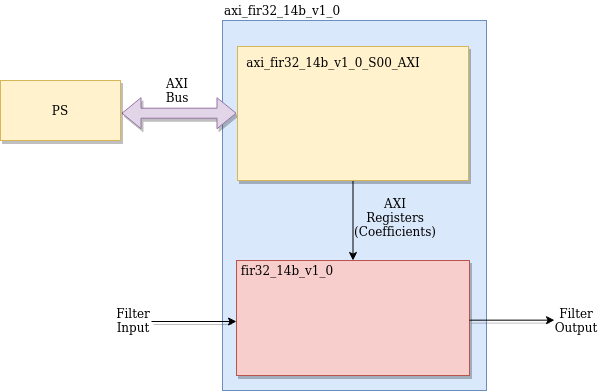
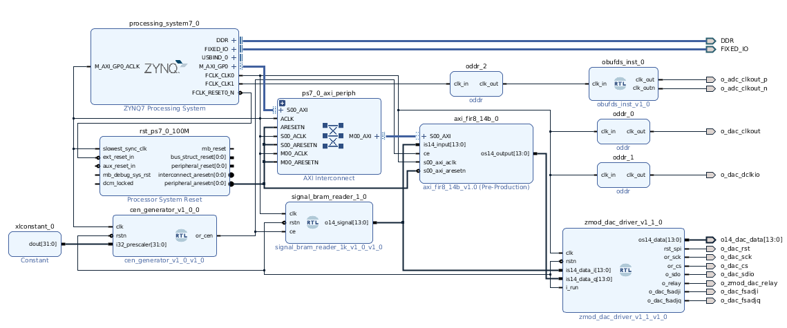

# Project documentation  
This project uses PL of the zynq for implement a signal processing system with a 32 order fir filter, a clock enable generator for reduce the frequency, and a signal generator. The PS also is used for run PetaLinux and a C application for compute the coefficients, a Hanning window, quantification and send them to the custom IP through AXI Bus.

## FIR filters structure.
FIR filter are digital non-recursive filters. Also known all-zeros filters, these filters, according their equation, have only a number of zeros which are corresponding with the order of the filter. Also, this filters can be represented as a number of zeros and the same number of poles located at the origin. Whether we represent it as an all-zeros filter, or with poles at the origin, these filter cannot be unstables, and that is an advantage to implement them on digital systems because the quantification process can change the behaviour of the filter, but never will make them unstables.  
Typical structure of the filter is shown on the next figure.  

FIR filters are a set of multiplications and additions that can be synthesized on any embedded system like FPGAs and Microcontrollers.

## Fit a FIR filter on DSP48E1 structure.
As it said, FIR filter are ideal to implement them on embedded systems. Focusing on FPGAs, devices of all manufacturers are a set of slices (or cells), that can be used for several purposes like memory, LUTs, logic... One of these slices are focused on perform the colled DSP operations, that essentially perform a MAC operation, that is a Multiplication and ACcumulation, or multiplication and addition. Xilinx 7 series have a type of Slice named DSP48E1, and their structure is the next.

DSP48E1 has 4 data inputs (A, B, C y D), and the operation that they perform are ((A+D)xB+C). To implement a FIR filter, these type of slices are ideal, due to the FIR structure can be accomodate by using one of these slices to perform the MAC Operation. On the next figure you can see how these slices are combined to implement a FIR filter.  

It's important to notice that this structure is valid if the width of the operation is compatible with the width of the slice. In case of DSP48E1 slices, it can be perform a multiplication of 2 operands with width of 18x25 bits. In case that the operation requires more bits, synthesyzer will combine 2 or more slices to perform the operation. This is the case of this project, where the filter is designed with a multiplication of 32x32 bits.

## Creating the FIR AXI IP

To create and AXi IP you can check my hackster.io project  
 https://www.hackster.io/pablotrujillojuan/designing-a-custom-axi-ip-on-vitis-a0ad06

The  next image is corresponding with the structure of the AXI FIR Filter.

## AXI Addresses

**AXI FIR Filter** Address: 0x43C00000  

|Offset|Description|
|-|-|
|0x0|Coefficient b0|
|0x4|Coefficient b1|
|0x8|Coefficient b2|
|0xc|Coefficient b3|
|0x10|Coefficient b4|
|0x14|Coefficient b5|
|0x18|Coefficient b6|
|0x1c|Coefficient b7|
|0x20|Coefficient b8|
|0x24|Coefficient b9|
|0x28|Coefficient b10|
|0x2c|Coefficient b11|
|0x30|Coefficient b12|
|0x34|Coefficient b13|
|0x38|Coefficient b14|
|0x3c|Coefficient b15|
|0x40|Coefficient b16|
|0x44|Coefficient b17|
|0x48|Coefficient b18|
|0x4c|Coefficient b19|
|0x50|Coefficient b20|
|0x54|Coefficient b21|
|0x58|Coefficient b22|
|0x5c|Coefficient b23|
|0x60|Coefficient b24|
|0x64|Coefficient b25|
|0x68|Coefficient b26|
|0x6c|Coefficient b27|
|0x70|Coefficient b28|
|0x74|Coefficient b29|
|0x78|Coefficient b30|
|0x7c|Coefficient b31|

## Block design description
This project is based on Zynq device, and the structure of the project is based on the next block design.

Modules used on this project:
- **zynq processing system**. Instantiation of the ARM processor. is in charge of manage Petalinux and the AXI Master interface. Configuration of this IP is the default for Eclypse Z7 board.
- **cen_generator_v1_0**. Module used to generate the clock enable according prescaler connected to i32_prescaler.
- **signal_bram_reader**. Module used to read the demo signal from infered bram.
- **oddr**. Module used to generate the output clocks for DAC using clock paths. (https://www.controlpaths.com/2020/03/21/ddr-resources/)
- **obufds**. Differential output buffer to generate differential clock.
- **axi_fir8_14b**. AXI FIR filter.
- **zmod_dac_driver**. Driver for ZMOD DAC board.
